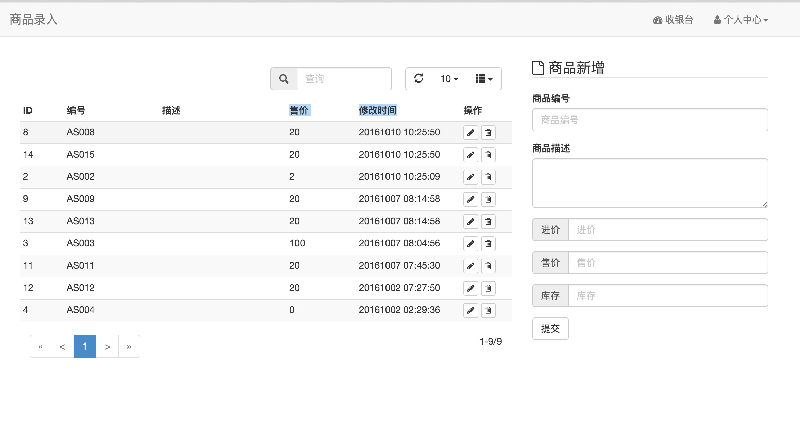
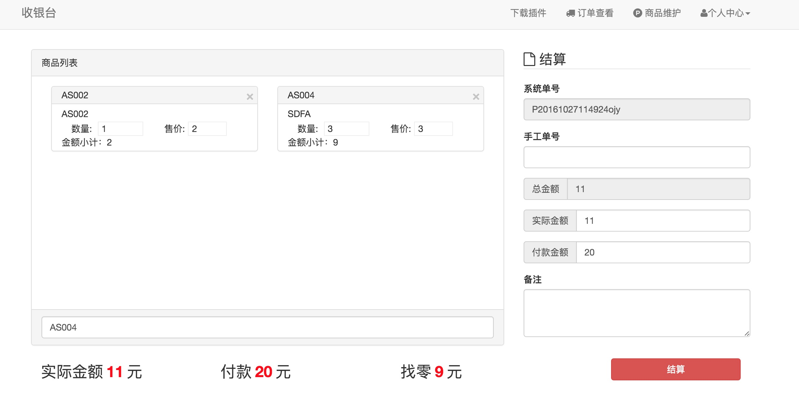

# easypos
简单收银系统（用于单体小店铺），个人业余时间用golang语言实现，如果您有更好的意见，可以提交issue。大家一起学习，一起讨论。
#### 功能
1. 商品维护
2. 创建订单
3. 查询订单
4. 库存控制
5. 打印小票(只支持ie)

#### 界面截图
1. 商品维护界面

2. 收银界面的截图

---
#### 演示环境
- 账号： admin／123 方便他人，请不要修改密码！
[演示地址](http://easypos.hellowcloud.com/) 

---

#### 项目使用的框架
1. [macaron](https://github.com/go-macaron/macaron)
2. [xorm](https://github.com/go-xorm/xorm)
---
#### 如果您想鼓励我，您可以通过支付宝或微信表示对我的支持
1. 支付宝 
* 

2. 微信支付
* 